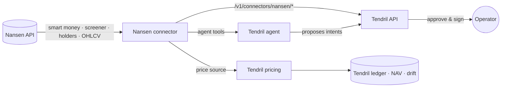

# Nansen × Tendril — smart-money portfolios, built and run by an agent

> **Tendril** is a Portfolio Management OS by [OpenDelta](https://www.opendelta.com): one place to see, run and
> account for everything you own onchain, wherever it happens to be held — self-custody, multisigs or
> regulated custodians, across chains, on one real-time ledger. Agents do the research and lay out options;
> **you** keep the decision.

This repository is the **Nansen connector for Tendril**: it brings [Nansen](https://www.nansen.ai)'s onchain
intelligence — smart-money holdings and flows, token market data, token profiles and top holders — into Tendril,
where the Tendril agent can use it to research, weight and build a portfolio, and where Tendril can price and
track the result.

It is also a reference for **what a Tendril connector looks like**, written against the upcoming
[Tendril Connector SDK](sdk/README.md) (preview).

## Why NansenAI + Tendril

**NansenAI knows *what* to buy.** Nansen has labelled millions of wallets and follows where the best-performing
traders and funds put their money. That's the signal: which tokens smart money holds, what it's accumulating, who
holds a token, and what it's worth.

**Tendril is *where* you hold it — and how safely.** Acting on a signal is where the risk lives. In a consumer
app you trade from an embedded hot wallet: one person, one key, the chains that wallet supports. Tendril is built
for money that needs more than that:

- **Your custody, any chain.** Multisigs (Safe, Squads), hardware and regulated custodians — chain-agnostic, with
  new chains and venues added as connectors. In the demo the portfolio lands in two multisigs on two chains.
- **Teams, not just individuals.** A portfolio has members with roles and allowances; agents only *propose*, people
  approve and sign.
- **Books you can trust.** A real-time ledger values every position — NAV, allocation drift, income statements,
  security and risk reports — for the whole portfolio, across wallets and chains.

**Together:** Nansen's intelligence drives the decision, Tendril's agent turns it into a plan, and Tendril's
custody, controls and accounting carry it out — with you approving every step.

> **Heads-up:** this code runs inside Tendril. Tendril is currently in **closed beta** — to run the connector
> end to end you need access to the Tendril API. [Join the waitlist →](https://tendril.opendelta.com/waitlist)

---

## Watch the demo

**[▶ Watch the 1-minute demo](https://drive.google.com/file/d/1bzcGeMXPA8OUJGI08QjVCUjqiGKLbFvp/view?usp=sharing)** — Nansen research → multisigs → buy & move → drift check.
(Also in this repo: [`videos/tendril-nansen-demo-1min.mp4`](videos/tendril-nansen-demo-1min.mp4).)

In the demo an operator talks to the Tendril agent — no forms, no scripts:

1. *"Find the top 3 smart-money holdings on Base and Solana, no stablecoins, compare their market caps and suggest
   a target allocation — no single token above 50%."* → the agent screens **Nansen smart-money holdings**, weights
   the six picks by market cap and flags a yield-bearing receipt token.
2. *"Create a Safe on Base and a Squads multisig on Solana, both 1-of-1."* → the agent **proposes** both
   deployments; the operator approves and signs.
3. *"Buy the six tokens with 50 USDC at those weights and move everything into the multisigs."* → one plan:
   bridge the Base share over CCTP, six swaps (1inch on Base, Jupiter on Solana), six transfers into custody —
   every transaction approved and signed by the operator.
4. *"Check the portfolio against the latest Nansen data — would a rebalance be needed?"* → fresh smart-money
   ranking and market caps, target vs current weights, drift per token, and what would trigger a rebalance.

The result: a 50 USDC, six-token smart-money portfolio held in two multisigs on two chains, within 0.2
percentage points of its Nansen-derived target. Step-by-step: [docs/demo.md](docs/demo.md).

---

## What the connector adds to Tendril



| Surface | What you get |
| --- | --- |
| **Data routes** on the Tendril API | `smart-money/holdings` (top N per chain, with market caps) · `smart-money/netflow` (what smart money is buying/selling) · `tokens/market-data` (price, market cap, liquidity — batched) · `tokens/info` · `tokens/holders` (by Nansen label). Every token row is annotated with its Tendril asset id when Tendril already knows the token. |
| **Price source** | Nansen prices long-tail tokens (memecoins, fresh smart-money picks) that exchange feeds often don't list, so anything the agent buys can be valued for NAV, drift and reporting — with market cap stored alongside each price. |
| **Agent tools** | `nansen_smart_money_holdings`, `nansen_smart_money_netflow`, `nansen_token_market_data`, `nansen_token_info`, `nansen_token_holders`, and `weights_from_values` — deterministic basis-point weights (floor / cap, exact amount splits), so portfolio maths is never left to the model. |

The connector is **read-only**. It never moves funds: when you act on Nansen data, Tendril's execution
connectors (swaps, bridges, custody) propose the transactions, and you approve and sign them.

---

## Repository layout

```
connector/src/
  index.ts          connector definition — kind, capabilities, secrets, hooks
  client.ts         Nansen REST client (schema-validated responses)
  schemas.ts        Nansen response schemas + connector config
  routes.ts         read-only data routes mounted on the Tendril API
  price-source.ts   Nansen as a Tendril price source (spot + OHLCV history)
  agent-tools.ts    tools the Tendril agent can call
  weights.ts        deterministic portfolio weighting (bps, floor/cap, exact splits)
connector/test/     unit tests for the parts that run standalone
sdk/                Tendril Connector SDK — preview of the connector interface
docs/               connector model, demo walkthrough
examples/           calling the connector through the Tendril API
videos/             demo videos
```

---

## How it's meant to be used

**Requirements**

- A Tendril workspace with API access (closed beta — [waitlist](https://tendril.opendelta.com/waitlist)).
- A Nansen API key ([app.nansen.ai/api](https://app.nansen.ai/api)).

**1. Enable the connector** in your Tendril workspace and give it the key as a secret (never as config):

```jsonc
// connector instance
{
  "kind": "nansen",
  "config": { "chains": ["solana", "base", "ethereum"] },
  "secrets": { "NANSEN_API_KEY": "••••" }
}
```

Tendril derives the connector's capabilities from that config (`data.smart_money`, `data.market`, … scoped to
the chains you chose) and resolves it by capability — anything that needs smart-money data on Base finds it.

**2. Call it through the Tendril API** — see [examples/tendril-api.md](examples/tendril-api.md):

```bash
curl "$TENDRIL_API_URL/v1/connectors/nansen/smart-money/holdings?chains=solana,base&limitPerChain=3" \
  -H "Authorization: Bearer $TENDRIL_API_KEY"
```

**3. Or just ask the agent.** With the connector enabled, the Tendril agent picks up the Nansen tools
automatically: *"use Nansen to find what smart money holds on Base"* is enough.

**Running the tests** (the standalone parts — client and weighting):

```bash
npm install
npm test
npm run typecheck
```

Everything else needs a Tendril runtime and does not execute on its own.

---

## Build your own connector

This connector is written against the **Tendril Connector SDK** — a small interface: declare capabilities,
config and secrets; implement data routes, a price source or agent tools; Tendril does the rest (ledger,
pricing policy, permissions, approvals, signing, API, agent). Read [docs/connector-model.md](docs/connector-model.md)
and [sdk/README.md](sdk/README.md).

The SDK is not published yet. If you'd like to build a connector for Tendril, or run your treasury or fund on
it, **[join the closed beta](https://tendril.opendelta.com/waitlist)** — and read the story behind it in
[Introducing Tendril](https://www.opendelta.com/blog/introducing-tendril).

---

## License

Apache License 2.0 — see [LICENSE](LICENSE) and [NOTICE](NOTICE). The license covers this repository's code; it
does not grant rights to the "Tendril" or "OpenDelta" names, and it does not cover the Tendril platform or API,
which are not open source.

*Built for the Nansen Meridian Buildathon. Nansen data © Nansen. Tendril is a product of OpenDelta Labs Ltd.*
